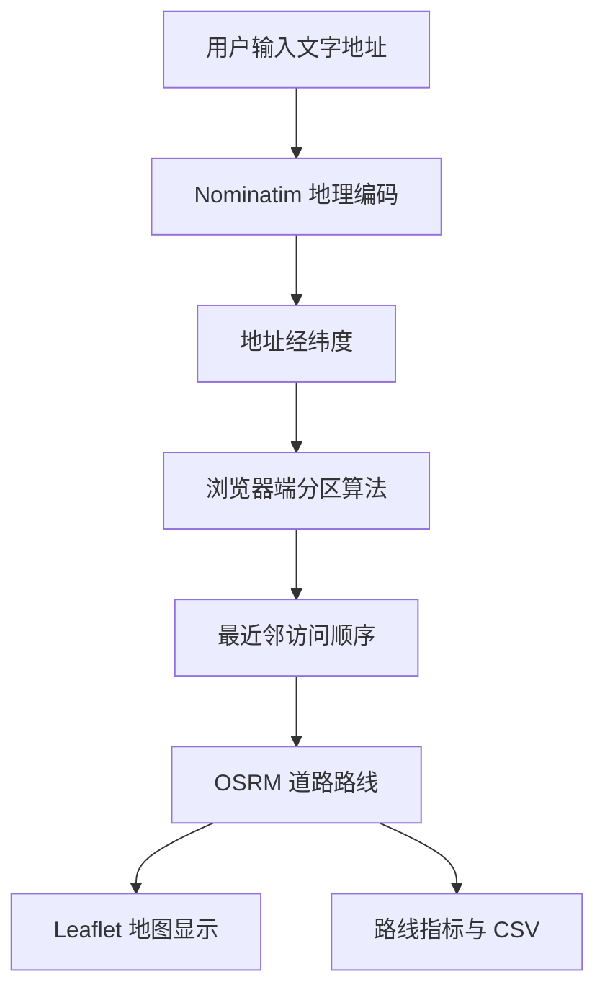
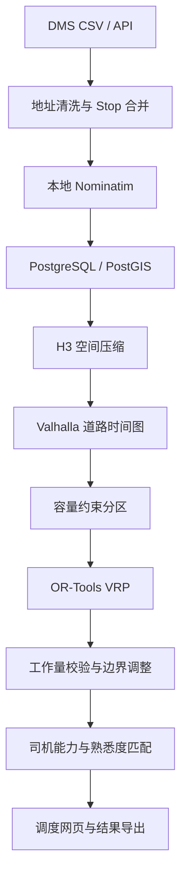

# Albany Route Planner — 完整项目文档

## 1. 项目简介

Albany Route Planner 是一个面向纽约州 Capital Region 的末端配送路线模拟网页，当前覆盖：

- Albany
- Troy
- Schenectady
- Clifton Park
- 周边区域，例如 Niskayuna

用户输入文字地址、线路数量及每站服务时间后，系统会完成地址定位、配送区域划分、访问顺序生成、道路路线计算和结果可视化，并支持导出路线分配 CSV。

当前版本是用于验证业务流程和算法思路的静态 MVP，不是生产级调度系统。

## 2. 在线地址与代码仓库

- 在线网页：<https://yezifan911-hash.github.io/albany-route-planner/>
- GitHub 仓库：<https://github.com/yezifan911-hash/albany-route-planner>

## 3. 当前功能

### 3.1 输入

- 出发站文字地址
- 配送地址，每行一个
- 计划生成的线路数量
- 每个配送站点的预计服务时间

### 3.2 处理

- 对重复地址去重
- 将文字地址转换为经纬度
- 根据出发站和地址空间分布划分配送区域
- 平衡各线路的 Stop 数量
- 为每条线路生成近似配送顺序
- 根据道路网络计算路线、里程和驾驶时间
- 将每站服务时间加入线路总时间估算

### 3.3 输出

- 地图上的彩色路线
- 每个 Stop 的线路编号和访问顺序
- 每条线路的 Stops、Miles、Driving Time 和 Estimated Time
- 总 Stops、总 Routes、总里程和最长线路时间
- CSV 导出文件

## 4. 使用流程

1. 打开在线网页。
2. 在“出发站地址”中填写站点地址。
3. 在“配送地址”中每行填写一个地址。
4. 设置线路数量。
5. 设置每站预计服务分钟数。
6. 点击“生成路线”。
7. 在地图和右侧结果栏查看线路。
8. 点击“导出 CSV”保存分配结果。

导出的 CSV 字段包括：

| 字段 | 含义 |
|---|---|
| `address` | 配送地址 |
| `route` | 分配的线路编号 |
| `stop_order` | 在线路中的访问顺序 |
| `latitude` | 纬度 |
| `longitude` | 经度 |

## 5. 系统架构

当前版本采用纯静态前端架构：



网页由 GitHub Pages 托管。所有计算逻辑均在浏览器执行，目前没有独立后端和数据库。

## 6. 技术组成

| 组件 | 当前用途 |
|---|---|
| HTML / CSS / JavaScript | 页面、交互和核心逻辑 |
| Leaflet | 地图显示与线路绘制 |
| OpenStreetMap | 地图底图 |
| Nominatim | 文字地址转经纬度 |
| OSRM | 道路路线、距离和驾驶时间 |
| GitHub Pages | 静态网页托管 |
| GitHub Actions | 自动部署网页 |

## 7. 当前算法

### 7.1 地址标准化与去重

系统读取每行地址，删除空行并对完全相同的地址字符串去重。

当前版本尚未处理以下近似重复形式：

- `100 Main Street` 与 `100 Main St`
- 同一建筑的不同 Unit
- 拼写错误或 ZIP Code 缺失

### 7.2 地理编码

每个地址通过 Nominatim 转换为：

```text
Address → Latitude / Longitude
```

查询范围限制在 Albany 周边，以降低同名地址匹配到其他州的概率。成功结果会缓存到浏览器 `localStorage`，减少重复请求。

### 7.3 路线分区

当前使用简化的 Geographic Sweep 方法：

1. 以出发站为中心。
2. 计算每个 Stop 相对于出发站的方向角。
3. 按方向角排序。
4. 根据线路数量切成若干连续分区。
5. 尽量使每条线路包含相近数量的 Stops。

这种方法可以快速产生空间连续的初步线路，但当前仅平衡 Stop 数量，没有直接平衡道路时间、包裹数或服务难度。

### 7.4 访问顺序

每条线路内部使用最近邻启发式：

1. 从出发站开始。
2. 选择距离当前点最近的未访问 Stop。
3. 重复直到访问全部 Stop。
4. 最后返回出发站。

当前最近邻判断使用经纬度球面距离；最终路线形状、道路里程和驾驶时间由 OSRM 计算。

### 7.5 工作时间估算

每条线路预计时间为：

```text
Estimated Route Time
= OSRM Driving Time
+ Stop Count × Service Minutes per Stop
```

该公式尚未加入装车时间、休息时间、交通时段、停车难度和异常件处理时间。

## 8. 文件结构

```text
albany-route-planner/
├── index.html
├── README.md
├── PROJECT_DOCUMENTATION.md
└── .github/
    └── workflows/
        └── pages.yml
```

| 文件 | 用途 |
|---|---|
| `index.html` | 完整网页、样式和 JavaScript 逻辑 |
| `README.md` | 项目快速说明 |
| `PROJECT_DOCUMENTATION.md` | 完整项目文档 |
| `.github/workflows/pages.yml` | GitHub Pages 自动部署 |

## 9. GitHub Pages 部署

代码提交到 `main` 分支后，GitHub Actions 会执行：

1. Checkout 仓库。
2. 配置 GitHub Pages。
3. 上传静态网页 Artifact。
4. 部署到 GitHub Pages。

工作流文件：

```text
.github/workflows/pages.yml
```

## 10. 数据与隐私

当前网页不会把地址保存到本项目的仓库或数据库，但会使用第三方公共服务：

- 文字地址发送至公共 Nominatim 服务。
- 路线坐标发送至公共 OSRM 服务。
- 地图瓦片从 OpenStreetMap 服务器加载。

因此：

- 不建议在演示版中使用需要保密的真实客户地址。
- 不建议使用演示版处理完整生产订单。
- 若用于实际站点，应部署本地 Nominatim 和 Valhalla/OSRM。
- 生产版应加入账号、权限、日志和数据保留策略。

## 11. 当前限制

- 每次最多 60 个地址。
- 公共地理编码接口需要限制请求频率。
- 仅支持文字地址逐行输入，尚不支持上传 DMS CSV。
- 当前分区主要平衡 Stops，不平衡 Packages 或真实工作量。
- 没有车辆容量、司机能力或路线熟悉度模型。
- 没有时间窗、承诺时效或优先件约束。
- 没有实时交通或站点历史速度修正。
- 没有将同一建筑或邻近门牌合并成一个 Stop。
- 最近邻算法不能保证全局最优。
- 公共服务的稳定性和请求量不适合生产环境。

## 12. 生产版建议架构



建议技术栈：

- Frontend：React + MapLibre 或 Leaflet
- API：Python FastAPI
- Database：PostgreSQL + PostGIS
- Geocoding：本地 Nominatim
- Routing：Valhalla
- Optimization：Google OR-Tools
- Spatial Index：H3
- Deployment：Docker + Linux Server

## 13. 下一阶段开发路线

### Phase 1：完善静态 MVP

- 支持 CSV 上传
- 自动识别地址字段和运单号字段
- 支持 Packages 与 Stops 分别统计
- 显示无法识别地址并允许人工修正
- 支持手动将 Stop 移至其他 Route
- 支持重新计算线路

### Phase 2：工作量优化

- 加入每个 Stop 的包裹数量
- 根据住宅、商业、Apartment 等类型估计服务时间
- 按预计总工时而不是 Stop 数量平衡
- 检测超时风险和线路负荷差异
- 加入线路连续性和边界优化

建议工作量公式：

```text
Route Workload
= Driving Time
+ Service Time
+ Package Handling Time
+ Stop Difficulty Penalty
+ Expected Exception Time
```

### Phase 3：司机匹配

- Driver Capacity
- Historical Delivery Rate
- Exception Rate
- False Delivery Rate
- Route Familiarity
- Small-Sample Reliability Adjustment

司机匹配应在线路形成后进行，避免用司机能力直接破坏地理连续性。

### Phase 4：本地路线引擎

- 下载 Albany / New York OSM 数据
- 使用 Docker 在 Mac 或 Linux 部署 Valhalla
- 使用本地 Matrix API
- 用历史 GPS 速度修正道路时间
- 停止依赖公共 Nominatim 和 OSRM 演示服务

### Phase 5：生产系统

- 多用户登录和角色权限
- 每日订单导入与历史版本
- 路线审批和人工调整
- 调度结果发送至 DSP/Driver
- 执行结果回传与模型校准
- KPI Dashboard 和异常追踪

## 14. 建议的优化目标

生产版本不应只优化最短里程，建议目标函数同时考虑：

```text
Minimize:
  Total Driving Time
+ Workload Imbalance Penalty
+ Overtime Penalty
+ Route Fragmentation Penalty
+ Route Change Penalty
+ Service Risk Penalty
```

其中 `Route Change Penalty` 用于保持历史线路稳定。如果调整只节省少量时间，应优先保留司机熟悉的路线边界。

## 15. 适用范围

当前版本适合：

- 展示路线规划概念
- 测试地址输入和地图展示
- 比较不同线路数量的初步效果
- 讨论站点分区和工作量逻辑
- 作为后续本地 Valhalla 系统的前端原型

当前版本不适合：

- 每日处理数千票生产订单
- 存储真实客户地址
- 直接作为司机导航系统
- 自动下发生产线路
- 替代人工审核与调度决策

## 16. 结论

Albany Route Planner 当前已经完成了从文字地址到地图路线的最小闭环：

```text
文字地址
→ 经纬度
→ 配送分区
→ 访问顺序
→ 道路路线
→ 工作量指标
→ CSV 导出
```

下一步最有价值的升级是加入 DMS CSV、Packages/Stops 工作量、人工调线，以及本地 Valhalla 路由服务。完成这些模块后，项目才能逐步从路线演示网页发展为可用于站点决策支持的配送优化系统。
